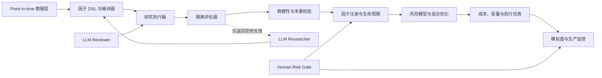

# AutoAlpha 机构级改进目标总纲

> 文档状态：Implemented v2<br>
> 适用范围：A 股多因子截面研究、组合构建与自动化因子挖掘<br>
> 当前协议：institutional_v2<br>
> 目标定位：可审计、可复现、可交易、可持续运营的机构级研究平台

---

## 1. 文档目的

本文档统一描述 AutoAlpha 的长期改进目标、设计原则、能力边界、阶段路线和验收标准。
它回答四个问题：

1. 当前框架需要先修复什么，才能成为可信研究系统；
2. 可信研究系统还缺少什么，才能支持机构级多因子挖掘；
3. LLM 应在哪些环节发挥作用，又必须被隔离在哪些边界之外；
4. 每个阶段交付到什么程度，才可以进入下一阶段。

本文档是目标与治理总纲，不替代具体模块的设计文档、数据字典、回测口径说明和生产运行手册。

---

## 2. 当前定位与目标定位

### 2.1 当前定位

AutoAlpha 是 LLM 介入但不掌握评价权和生产权限的机构级研究平台：

- Researcher 通过类型化 DSL 或受限源码提出候选；
- Reviewer 独立检查经济机制、时间语义、重复性和复杂度；
- Executor 在冻结协议与隔离环境中生成完整证据矩阵；
- 确定性门禁负责研究、holdout、模拟盘和生产准入；
- 人类研究、数据、风险和运维负责人共同维护生产治理。

平台不提供连续总分、单文件研究循环或可绕过门禁的兼容入口。

### 2.2 目标定位

目标系统应具备以下能力：

- 所有输入数据均满足 point-in-time，可追踪来源、版本和可见时间；
- 所有因子均有明确公式、经济假设、依赖、时间语义和完整实验血缘；
- 所有研究结论均经过防泄漏切分、多重检验、稳健性和样本外验证；
- 因子价值按其对现有组合的边际贡献衡量，而非只看单因子得分；
- 回测完整模拟 A 股交易制度、成本、容量和不可成交风险；
- 信号通过风险模型和约束优化转化为可执行组合；
- LLM 的提案、代码、权限和反馈受到隔离、预算与审计约束；
- 从研究、模拟盘到生产存在明确审批、监控、降级和退役机制。

---

## 3. 总体原则

### 3.1 研究原则

- **时间正确优先**：任何结果必须先证明没有未来信息，再讨论收益表现。
- **证据链优先**：不允许用单一分数替代统计显著性、稳健性、成本和风险分析。
- **边际贡献优先**：因子是否进入生产取决于它对已有组合的增量价值。
- **失败同样留档**：失败、重复、失效和退役因子都是研究资产，必须保留。
- **简单性有价值**：在效果相近时，优先选择经济含义清晰、参数更少、容量更高的方案。

### 3.2 工程原则

- **可复现**：数据版本、代码、配置、随机种子、依赖和模型均可精确重放。
- **最小权限**：研究 Agent、评估器、测试集、生产数据和交易接口物理隔离。
- **配置即协议**：研究口径、切分、成本和约束通过版本化配置声明，不散落在代码中。
- **制品不可变**：已发布的实验、因子卡、模型和回测结果不得原地修改，只能生成新版本。
- **可观测**：研究耗时、资源、失败率、数据异常、漂移和实盘偏差均可监控。

### 3.3 LLM 使用原则

- LLM 主要负责提出假设、组织证据、生成受控表达式和解释结果；
- LLM 不直接掌握测试集、评估规则写权限、生产凭证或无限实验预算；
- LLM 生成的任何代码和结论必须经过确定性程序验证；
- 不把模型自信、文字解释或单次得分视为研究证据。

---

## 4. 目标架构



平台不以任何连续总分完成决策，而采用多阶段准入：

```text
数据合法性
  -> 因子语义合法性
  -> 预测有效性
  -> 统计显著性
  -> 独立增量
  -> 跨时期稳健性
  -> 成本与容量
  -> 组合贡献
  -> 隔离样本外复核
  -> 模拟盘观察
  -> 生产准入
```

---

## 5. P0：基础可信性修复

以下九项是进入机构级建设前的阻断项。

### P0-01 LLM 编排缺失

目标：实现可控的实验编排器，明确读取、提案、修改、执行、反馈和停止流程。

完成标准：实验可自动运行，但 Agent 无权绕过审批、扩大文件范围或无限试验。

### P0-02 交付不完整与文档漂移

目标：补齐依赖、数据契约、测试、`judge` 流程和可运行示例，清除文档与实现不一致。

完成标准：全新环境可按文档完成安装、基线实验、验证集评估和隔离测试复核。

### P0-03 安全边界过度依赖静态禁词

目标：将测试集、锁定代码、实验历史和评估器放入独立权限域与隔离进程。

完成标准：即使候选代码具有对抗性，也无法读取测试集、改写评估规则或访问生产凭证。

### P0-04 切分定义没有完整冻结

目标：对数据、交易日历、切分内容、标签配置和评估配置共同生成不可变指纹。

完成标准：任何日期、数据或评估口径变化均产生新实验世代，历史结果不再直接比较。

### P0-05 成交判断包含未来信息和乐观剔除

目标：用真实可获得的开盘状态或可成交模型处理买卖限制，不再用收盘状态判断开盘成交，
不可卖持仓必须延迟退出或持续计价。

完成标准：构造涨跌停、停牌、开板和无法卖出案例的回测单元测试，结果符合逐笔持仓逻辑。

### P0-06 H 日收益均摊导致路径失真

目标：建立逐日持仓与 cohort 账本，按真实每日价格更新净值、风险和回撤。

完成标准：现金、持仓、成交、费用和每日 PnL 可逐项对账，不能由未来 H 日收益反推中间路径。

### P0-07 重叠标签 ICIR 被高估

目标：对重叠标签使用非重叠抽样、HAC/Newey-West 或 block bootstrap 估计不确定性。

完成标准：报告原始 IC、调整后标准误、置信区间和有效样本数。

### P0-08 验证集自适应过拟合

目标：限制实验预算，引入 purged/embargo walk-forward、嵌套验证和永久隐藏测试集。

完成标准：候选选择与最终泛化估计使用不同数据，测试集只允许受控、低频、可审计访问。

### P0-09 规则声明与执行不一致

目标：落实 buffer、修改因子相关性、行数、运行时间、依赖和 import 白名单等硬约束，修复路径语义。

完成标准：所有硬约束都有自动测试，文档规则与机器执行结果一致。

---

## 6. G1：Point-in-time 数据与研究主表

### 目标

建立机构研究可使用的历史时点数据层，消除幸存者偏差、公告时间泄漏和口径漂移。

### 必备能力

- 每日动态股票池、上市退市、ST、停复牌、名称历史和板块归属；
- 交易日历、涨跌停制度、除权除息和复权因子；
- 历史指数成分、行业分类、自由流通市值和可交易状态；
- 财务数据按公告时间、修订版本和实际可见时间入库；
- 复权研究价格与真实交易价格分层存储；
- 数据来源、批次、版本、checksum、字段血缘和质量报告；
- 原始层、标准层、point-in-time 特征层和研究快照分层。

### 完成标准

- 任意研究日期均可回答“当时可见哪些股票、字段和值”；
- 任意实验可恢复到完全相同的数据快照；
- 数据质量失败会阻止实验，而不是静默填充；
- 研究面板的主键、时区、单位、缺失语义和可见时间均有数据契约。

---

## 7. G2：受控因子 DSL 与语义编译器

### 目标

将 LLM 的输出从任意 Python 代码收敛为可静态验证、可去重、可优化的因子表达式。

### 必备能力

- 类型化算子：`delay`、`delta`、`rolling_*`、`rank`、`winsorize`、`neutralize` 等；
- 每个算子声明输入类型、输出类型、时间方向、窗口、最小历史长度和复杂度；
- 禁止负延迟、全样本拟合、跨切分统计和未来字段；
- 表达式规范化、哈希、等价表达式识别和公共子表达式复用；
- 自动生成公式说明、经济假设、数据依赖、覆盖率和预估计算成本；
- 版本化算子注册表和向后兼容策略；
- 必要时允许审核后的 Python 扩展算子，但不允许候选代码直接访问文件系统。

### 完成标准

- 每个因子都能在执行前完成时间语义检查；
- 同一表达式得到稳定、唯一的因子 ID；
- 公式可以在不同执行引擎上得到数值一致结果；
- LLM 无法通过表达式读取评估结果、测试集或外部文件。

---

## 8. G3：统计评估与多重检验

### 目标

从“最高验证分获胜”升级为基于置信度、稳健性和研究次数的证据体系。

### 评估维度

- Rank IC、Pearson IC、IC hit rate、IC decay 和覆盖率；
- HAC t-stat、block bootstrap 置信区间和有效样本量；
- 十分组单调性、Top-Bottom spread 和多空组合表现；
- Purged/embargo walk-forward 与 nested validation；
- Deflated Sharpe Ratio、CSCV/PBO、False Discovery Rate；
- 参数邻域稳定性、时间稳定性和随机扰动敏感性；
- 样本内/样本外退化率及失败年份、最长失效期。

### 准入原则

- 不使用一个加权总分掩盖失败项；
- 先通过硬门槛，再在通过者中进行排序；
- 接受必须超过最小经济改善和统计置信要求；
- 研究次数、候选家族和参数搜索规模必须进入显著性调整；
- 所有未通过实验保留其表达式和失败原因。

### 完成标准

- 每个候选都有完整评估矩阵和置信区间；
- 同一因子在滚动窗口、参数邻域和子样本上不依赖单点幸运；
- 测试集结果不参与候选选择和参数调整；
- 评估报告可以明确区分预测能力、投资能力和统计偶然性。

---

## 9. G4：独立增量与因子生命周期

### 目标

评价因子对现有因子库和组合的边际贡献，而非孤立表现。

### 必备能力

- 行业、市值、Beta、波动率、流动性等暴露的逐层中性化；
- 因子相关、偏相关、条件 IC、增量解释度和边际组合 IR；
- 因子聚类、家族标签、经济来源和等价/近似重复识别；
- 候选、研究中、批准、模拟盘、生产、观察、衰退、退役状态；
- 失败因子墓地和重新研究冷却期；
- 因子拥挤、衰减、容量和生产后漂移监控；
- 因子卡记录公式、假设、数据滞后、适用市场状态、失败模式和负责人。

### 完成标准

- 新因子必须证明对生产候选组合存在净增量；
- 高度重复因子不会仅因名称或参数不同重复进入组合；
- 生产因子失效时能够自动降权、暂停并形成审查任务；
- 任意因子的完整 parent、实验、审批和退役链可追踪。

---

## 10. G5：风险模型与组合优化

### 目标

将预测信号转化为受风险、成本和容量约束的目标组合。

### 目标函数

```text
maximize  expected_alpha
        - risk_aversion * active_risk
        - turnover_penalty
        - transaction_cost
        - concentration_penalty
```

### 必备能力

- 行业、风格、Beta、市值、波动率、流动性和特异风险模型；
- 协方差收缩、风险暴露稳定化和压力情景；
- 个股权重、行业偏离、跟踪误差、持股数量和集中度约束；
- ADV 参与率、换手、停牌、涨跌停和最低成交金额约束；
- 长多、指数增强和市场中性等不同组合模板；
- 预期收益、风险、成本和约束影子价格的归因；
- 优化不可行时的约束诊断和确定性降级策略。

### 完成标准

- 所有回测均由同一组合构建器产生目标权重；
- 信号收益可以分解为选股、行业、风格、Beta、成本和残差；
- 组合在基准、风险、集中度和流动性约束下保持可行；
- 优化结果对小幅参数变化不出现不可解释的大幅跳变。

---

## 11. G6：交易成本、容量与执行仿真

### 目标

回答策略是否可成交、可承载多大资金、实盘净收益是否仍有意义。

### 必备能力

- A 股 T+1、100 股整数手、印花税、佣金、过户费和最低费用；
- 停牌、涨跌停、开盘封板、延迟卖出、未成交和部分成交；
- 点差、波动率、ADV、订单占比和平方根冲击成本；
- VWAP、TWAP、POV、开盘和收盘执行策略；
- 信号衰减、等待成本、机会成本和排队风险；
- 不同资金规模下的净收益、净 IR、容量拐点和持仓集中度；
- 回测成交与实盘成交的 Transaction Cost Analysis。

### 完成标准

- 每笔模拟成交均有订单、成交、未成交、费用和冲击记录；
- 无法卖出的股票不会从收益中消失；
- 策略报告同时给出毛收益、费用、冲击和净收益；
- 能输出目标资金规模下的容量结论和推荐执行方案。

---

## 12. G7：LLM 多角色治理与实验预算

### 目标

让 LLM 提高研究广度和速度，同时防止权限越界、验证集刷分和不可审计决策。

### 角色划分

| 角色 | 职责 | 禁止权限 |
|---|---|---|
| Researcher | 提出经济假设和候选 DSL | test、评估规则、生产凭证 |
| Reviewer | 检查重复、泄漏、复杂度和经济逻辑 | 修改评分与直接接受 |
| Executor | 编译并运行批准表达式 | 任意文件、网络和动态代码 |
| Evaluator | 在隔离环境计算研究指标 | 向 Researcher 暴露隐藏数据 |
| Risk Gate | 检查风险、容量和成本 | 修改原始实验结果 |
| Human Approver | 解锁 test、批准生产与规则变更 | 绕过审计记录 |

### 治理要求

- 按因子族、阶段和时间分配实验预算；
- 记录模型、提示词、上下文、工具调用、代码差异和 token 成本；
- 使用受控、分级反馈，避免向 Researcher 暴露全部验证细节；
- 引入独立 Reviewer，对经济逻辑和泄漏风险进行反证；
- 支持暂停、终止、人工接管和确定性重放；
- 将 LLM 输出视为候选提案，不视为审批依据。

### 完成标准

- 任意实验可以解释“谁提出、基于什么证据、修改了什么、为何接受”；
- Agent 无法扩大权限或自行解锁 test；
- 达到预算、异常或稳健性失败条件时自动停止；
- 更换 LLM 不影响评估器和历史制品的可复现性。

---

## 13. G8：生产工程与模型风险管理

### 目标

建立从研究到模拟盘、生产、监控和退役的工程闭环。

### 必备能力

- 锁定依赖、容器镜像、CI、单元测试、属性测试和回归基准；
- 数据管道、因子计算、评估和组合构建的任务编排；
- 增量计算、缓存一致性、失败恢复和幂等执行；
- 数据、因子、模型、组合和报告制品注册；
- 模拟盘、影子组合和逐步放量机制；
- 数据漂移、IC 漂移、暴露漂移、成交偏差和 PnL 偏差监控；
- 告警、降级、暂停、回滚、灾备和运行手册；
- 研究审批、模型变更、生产发布和定期复核记录。

### 完成标准

- 研究结果可一键重放，但生产发布必须经过审批；
- 日常任务失败不会产生半成品或重复交易；
- 回测、模拟盘和实盘差异可以逐层归因；
- 生产因子和组合有明确所有者、SLA、监控阈值和退役机制。

---

## 14. 统一因子准入门槛

具体数值由后续评估宪法版本化确定，以下项目必须全部有结论：

| 维度 | 必须回答的问题 |
|---|---|
| 数据 | 是否 point-in-time，覆盖率和缺失是否稳定？ |
| 语义 | 是否存在未来函数、隐式全样本统计或不可解释算子？ |
| 预测 | Rank IC、Pearson IC、hit rate 和 decay 是否有效？ |
| 统计 | 调整重叠与多重检验后是否仍显著？ |
| 稳健 | 是否跨年份、市场状态、行业和参数邻域稳定？ |
| 独立 | 相对已有因子是否提供条件 IC 或组合增量？ |
| 风险 | 收益是否主要来自非目标行业、风格或 Beta 暴露？ |
| 交易 | 换手、成本、冲击、不可成交和容量是否可接受？ |
| 组合 | 加入后净 IR、回撤和风险预算是否改善？ |
| 样本外 | 隔离 OOS 与 test 的退化是否在允许范围内？ |
| 生产 | 模拟盘是否复现研究方向，是否具备监控与退役方案？ |

准入结论只能是：`REJECTED`、`RESEARCH`、`APPROVED_FOR_PAPER`、
`APPROVED_FOR_PRODUCTION`、`SUSPENDED` 或 `RETIRED`。

---

## 15. 分阶段路线图

### Phase 0：可信研究基线

范围：完成 P0 九项修复，补齐环境、测试、隔离评估和真实持仓回测。

出口条件：基线因子可以在无泄漏、可对账、可复现的环境中完成 train/val/test 全流程。

### Phase 1：机构研究内核

范围：G1 Point-in-time 数据、G2 因子 DSL、G3 统计评估。

出口条件：候选因子拥有可靠时间语义、统计置信度和多重检验后的研究结论。

### Phase 2：因子库与组合层

范围：G4 因子生命周期、G5 风险模型和组合优化。

出口条件：平台可以评价因子边际贡献，并生成满足风险约束的目标组合。

### Phase 3：交易与容量层

范围：G6 成本、容量、执行仿真和 TCA。

出口条件：目标资金规模下的净收益、容量和执行方案可以被审计和复现。

### Phase 4：LLM 自动研究平台

范围：G7 多角色 Agent、实验预算、受控反馈和自动停止。

出口条件：LLM 可以持续生成候选，但无法污染评估、扩大权限或绕过研究门槛。

### Phase 5：模拟盘与生产运营

范围：G8 生产工程、模型治理、监控、审批和退役。

出口条件：策略经过模拟盘观察和人类审批后可受控上线，并可持续监测研究与实盘偏差。

---

## 16. 近期优先级

按依赖关系，近期优先顺序如下：

1. 完成 P0 回测、统计和隔离问题修复；
2. 定义统一数据契约与 point-in-time 股票池；
3. 建立因子 DSL、表达式哈希和时间语义检查；
4. 建立 purged walk-forward、多重检验和实验预算；
5. 因子准入使用分层 gate，不提供单一总分；
6. 引入风险模型、约束优化和边际组合贡献；
7. 引入真实成本、容量和执行仿真；
8. 最后开放多角色 LLM 自动循环与生产化能力。

不得在数据、评估和回测尚未可信时扩大 LLM 搜索规模。自动化会放大研究系统已有的优点，
也会更快地放大偏差、泄漏和过拟合。

---

## 17. 非目标

以下内容不作为当前阶段目标：

- 追求无人监督、无人审批的全自动实盘交易；
- 允许 LLM 任意生成并执行 Python、SQL 或 shell；
- 以单次最高收益、最高 IC 或最高 Sharpe 作为成功标准；
- 在基础数据不具备 point-in-time 语义时扩展财务或另类因子；
- 在没有容量模型和风险约束时讨论大规模资金部署；
- 为了提高搜索速度而牺牲可解释性、审计性和可复现性。

---

## 18. 最终完成定义

AutoAlpha 达到机构级目标，需要同时满足：

- **可信**：无已知未来信息、幸存者偏差和乐观成交处理；
- **稳健**：通过滚动样本外、多重检验、子样本和参数扰动；
- **独立**：对现有因子和组合提供可证明的边际贡献；
- **可交易**：成本、容量、限制和执行均纳入结果；
- **受控**：LLM 权限、反馈、预算和停止条件清晰；
- **可审计**：数据、代码、配置、提示词、决策和制品完整留痕；
- **可运营**：支持模拟盘、生产监控、降级、暂停和退役；
- **可解释**：人类能够理解因子为何存在、何时有效、为何失效以及如何处理。

当且仅当上述条件同时成立，AutoAlpha 才应被视为机构级多因子量化交易研究平台，
而不只是一个能够自动寻找高验证分公式的实验工具。
