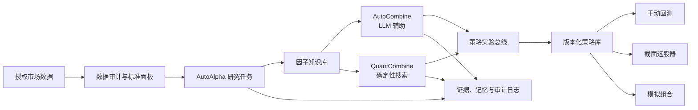

<div align="center">

# LLM_QUANT_FACTORY

### 可审计的多智能体 A 股因子研究与组合发现平台

一个面向 A 股截面多因子研究的源码可用工作台：从数据治理、LLM 辅助因子发现、因子知识库，
到受约束组合搜索、选股、回测、审计和策略版本管理。

[](https://github.com/khakhasshi/LLM_QUANT_FACTORY/actions/workflows/ci.yml)
[](LICENSE)
[](https://www.python.org/)
[](https://docs.astral.sh/uv/)
[](#研究边界)
[](#研究边界)

[快速开始](#快速开始) · [系统架构](#系统架构) · [研究样例](#公开研究样例) ·
[微信交流群](#微信交流群) · [贡献指南](CONTRIBUTING.md) · [路线图](ROADMAP.md) ·
[English](README_EN.md)

</div>

---

LLM_QUANT_FACTORY 的目标不是让大语言模型直接“决定买什么”，而是把模型放在一个可审计、可证伪、
受确定性协议约束的研究系统里。LLM 负责提出机制假设、生成受控表达式和形成结构化研究意见；
数据时点检查、回测、统计检验、组合权重、风险门禁和策略交付由确定性组件执行。

> [!IMPORTANT]
> 当前随项目验证的本地 A 股面板是 **non-PIT 研究代理数据**。截图中的历史绩效、排名和选股
> 结果仅用于展示研究流程，不代表生产资格、未来收益或投资建议。真实交易前仍需补齐 PIT
> 股票状态、复权与未复权成交口径、涨跌停、停牌、退市、费用、容量和独立盲测。

## 项目导览

### 1. AutoAlpha：连续因子研究

为每个研究任务冻结市场、数据可见范围、探索区、滚动验证区和隐藏测试区。系统持续运行
“机制诊断 → 候选生成 → 时序校验 → 纯多评价 → 组合增删 → 审计落库”，并展示实时指标曲线、
研究流程、连续记忆与四类日志。


### 2. AutoCombine：LLM 辅助组合研究

从因子知识库冻结候选快照，在最大因子数、权重步长、目标函数和时间协议内探索组合。LLM
可以提出组合假设和解释边际贡献，但不能越过确定性门禁、直接批准策略或读取隐藏测试指标。


### 3. QuantCombine：确定性组合优化

不调用 LLM，使用 SFFS、NSGA-II、自适应采样和 Pareto 排序完成因子筛选、子集搜索与非负权重
优化。每个候选都保留因子构成、权重、成本后纯多表现、最差折表现、相关性、有效下注与失败门禁。


### 4. 结构化 LLM 研究团队

研究员、数据官、风控官、组合经理、审计员和交易员分别输出结构化制品。独立复核、证伪设计、
失败归因和交易可执行性分析会进入同一证据链；最终裁决仍属于确定性引擎和人工风险审批。


### 5. 因子知识库

因子库不仅是排行榜。它保存公式与 AST、机制类型、来源任务、行为簇、同质簇、生命周期、
统一纯多指标、年度表现、失效标签和组合边际贡献，帮助研究者识别“新机制”与“换皮参数”。


### 6. 截面选股器

选择一个或多个因子、设置权重和信号日期，快速生成截面候选股票。选股结果明确标注信号在
日收盘后形成，页面本身不生成交易订单，也不会污染自动研究记忆或隐藏测试。


### 7. 手动纯多回测

手动回测支持因子与权重、时间区间、初始资金、目标仓位、持有期、调仓日历、费用预设、
事件账本或向量引擎、收藏与交割单。评价默认以 A 股纯多资金曲线为主，多空 IC 仅作为诊断。


## 系统架构



本仓库采用单体仓库结构，包含两个主要层次：

| 层次 | 路径 | 职责 |
|---|---|---|
| 数据工程 | `src/multifactor_ashare/` | 审计不可变日频快照，并构建按年分区的标准 DuckDB/Parquet 面板 |
| 研究平台 | `AutoAlpha/` | 因子发现、知识管理、组合优化、回测、治理与 Web 服务 |

研究平台使用统一的实验谱系：

```text
因子候选
  -> 机制簇 / 行为簇
  -> 组合候选
  -> 策略版本
  -> 模拟组合
  -> 生产候选（必须人工审批）
```

每个阶段都携带稳定 ID、协议指纹、数据快照、评价指标、失败门禁与证据链接。

## 已实现能力

| 领域 | 当前能力 |
|---|---|
| 研究编排 | 多个相互隔离的 AutoAlpha 任务，分别拥有数据可见范围、协议、记忆与生命周期 |
| 因子语言 | 类型化表达式树、字段白名单、信号时点和未来函数检查 |
| 评价体系 | A 股纯多主指标、滚动样本外、DSR/PBO/FDR、参数邻域、成本与容量诊断 |
| 知识管理 | 机制分类、AST 指纹、语义/行为聚类、生命周期、年度热力图与收藏 |
| 组合研究 | 在同一冻结因子注册表上运行 LLM 辅助 AutoCombine 和确定性 QuantCombine |
| 回测 | 快速向量引擎与事件/现金账本路径，可配置成交假设、交割单和制品 |
| 运行系统 | 作业队列、检查点、重试、不可变制品、四类日志与健康检查 |
| 数据中心 | 工作区检查、Tushare 凭证边界、断点增量更新与质量报告 |

详细控制说明见：

- [机构级研究控制](AutoAlpha/docs/INSTITUTIONAL_RESEARCH_CONTROLS.md)
- [评价章程](AutoAlpha/evaluation.md)
- [数据就绪度](AutoAlpha/docs/DATA_READINESS.md)
- [AutoCombine 设计](AutoAlpha/docs/AUTOCOMBINE.md)
- [QuantCombine 设计](AutoAlpha/docs/QUANTCOMBINE.md)
- [向量回测对账](AutoAlpha/docs/VECTOR_BACKTEST_ENGINE.md)
- [生产运行手册](AutoAlpha/docs/PRODUCTION_RUNBOOK.md)

## 研究边界

系统明确区分研究便利性与生产证据：

- A 股**纯多资金表现**是默认排序与展示口径。
- Rank IC 和多空 Alpha 仅用于诊断，不能抵消成交或风险硬门禁失败。
- 日终信号只能在收盘后获得，最早于下一交易日开盘执行。
- 公开滚动样本外结果可用于研究；隐藏测试细节永不进入 LLM 上下文。
- 失败的硬门禁不能被综合分平均掉。
- 手动回测、截图和公开样例不会进入自动研究记忆。
- 原始行情、API 凭证、本地运行数据库和私有 LLM 对话均不随仓库发布。

## 快速开始

### 环境要求

- macOS 或 Linux
- Python 3.12+
- [`uv`](https://docs.astral.sh/uv/)
- 自有且具备合法授权的 A 股数据
- 可选：用于 LLM 辅助研究的 OpenAI Compatible API

### 1. 克隆与安装

```bash
git clone https://github.com/khakhasshi/LLM_QUANT_FACTORY.git
cd LLM_QUANT_FACTORY

uv sync --frozen --all-groups
cd AutoAlpha
uv sync --frozen --all-groups
```

### 2. 准备数据

将已获授权的源数据放入 `data/`，然后执行可复现的数据审计与面板构建：

```bash
cd ..
uv run mf-data audit
uv run mf-data build
```

标准输出写入 `data/processed/daily_panel/`。原始数据和生成的市场数据均被 Git 忽略。

### 3. 配置可选凭证

请使用环境变量或系统钥匙串，切勿提交任何凭证：

```bash
cd AutoAlpha
export AUTOALPHA_DATA_PATH="$PWD/../data"
export OPENAI_BASE_URL="https://api.openai.com/v1"
export AUTOALPHA_MODEL="your-model"
export AUTOALPHA_API_KEY="your-api-key"
export AUTOALPHA_SERVICE_TOKEN="replace-with-a-strong-local-token"
```

常用设置详见 [`AutoAlpha/.env.example`](AutoAlpha/.env.example)。

### 4. 启动服务

```bash
./start-services.sh --no-resume
```

| 服务 | URL | 用途 |
|---|---|---|
| AutoAlpha | http://127.0.0.1:8788 | 研究任务、因子库、选股、回测、模拟组合、数据和作业中心 |
| AutoCombine | http://127.0.0.1:8888 | LLM 辅助的约束因子组合研究 |
| QuantCombine | http://127.0.0.1:8889 | 确定性的统计组合优化 |

使用以下命令停止全部三个服务：

```bash
./stop-services.sh
```

启停脚本可重复执行。只有显式设置 `AUTOALPHA_RESUME_TASK_ID` 或
`AUTOCOMBINE_RESUME_TASK_ID` 时，才会恢复历史任务。

## 公开研究样例

[`examples/public_research_snapshot/`](examples/public_research_snapshot/) 提供了一份从真实本地
研究数据库导出的少量脱敏记录：

| 公开记录 | 数量 | 展示内容 |
|---|---:|---|
| 因子定义 | 12 | 覆盖反转、流动性、波动率、估值、订单流、市值和动量机制的类型化表达式与谱系 |
| 组合候选 | 3 | 冻结因子与权重、纯多诊断、失败门禁和 `RESEARCH_LEADER` 语义 |
| 策略规格 | 1 | 版本化信号、调仓、成交、风险、成本与监控协议 |
| 审计事件 | 20 | 重新计算公开哈希链的脱敏行动/研究/审计/交付记录 |

样例明确排除了价格、证券级收益、持仓、私有提示词、隐藏测试结果、凭证、本机路径和可执行生产
决策。它用于展示数据契约，并非基准测试；没有另行授权的市场数据时，不能复现截图中的结果。

从自己的本地运行库重新生成脱敏样例：

```bash
uv run python scripts/export_public_research_snapshot.py \
  --database AutoAlpha/runtime-full-llm/autoalpha.sqlite3 \
  --output examples/public_research_snapshot
```

## 仓库结构

```text
.
├── src/multifactor_ashare/       # 数据审计与标准面板 CLI
├── tests/                        # 数据工程测试
├── AutoAlpha/
│   ├── src/autoalpha/            # 研究与服务实现
│   ├── config/                   # 版本化研究协议
│   ├── docs/                     # 机构级控制与运行手册
│   ├── tests/                    # 单元、集成与对抗测试
│   ├── start-services.sh
│   └── stop-services.sh
├── examples/public_research_snapshot/
├── docs/assets/screenshots/
├── scripts/                      # 公开导出与发布检查
└── .github/                      # CI 与贡献模板
```

## 开发与验证

运行完整本地验证：

```bash
# 数据层
uv run ruff check src tests scripts
uv run ruff format --check scripts/check_public_release.py scripts/export_public_research_snapshot.py
uv run pytest -q

# 研究平台
cd AutoAlpha
uv run ruff check .
uv run pytest -q

# 源码发布检查
cd ..
uv run python scripts/check_public_release.py
uv build --out-dir /tmp/multifactor-ashare-dist

# AutoAlpha 包构建
cd AutoAlpha
uv build --out-dir /tmp/autoalpha-dist
```

工作流、测试要求和研究证据规则详见 [CONTRIBUTING.md](CONTRIBUTING.md)。智能体和二次开发者
应先阅读 [AGENTS.md](AGENTS.md)，其中包含服务拓扑、代码责任索引、数据与研究不变量、改动配方、
测试矩阵和交接模板。

## 路线图与协作方向

项目尤其欢迎同行协作解决以下仍然困难的问题：

1. **更精细的因子知识管理**
   完善机制本体、参数家族折叠、时间衰减画像、失败标签、边际贡献图和可检索证据谱系。

2. **多个 LLM 线程与模型协作**
   建立结构化交接、分歧协议、角色记忆、模型多样性、成本控制和可复现的多智能体审议，同时
   禁止模型绕过确定性治理。

3. **因子同质化与虚假创新**
   研究 AST 等价、语义指纹、信号/收益行为聚类、残差发现，以及奖励独立组合贡献而非公式换皮
   的激励机制。

4. **PIT 数据与真实 A 股成交**
   补齐历史 ST、上市、退市、停牌状态、板块涨跌停、公司行动修订、开盘可交易性、整手/现金
   约束、冲击和容量。

5. **超越因子评分的策略生命周期**
   建立明确的开平仓规则、版本化策略规格、影子交易、衰减监控、退役机制和可复现晋级证据。

完整清单维护在 [ROADMAP.md](ROADMAP.md)。进行大型架构变更前，请先发起 Discussion 或 Issue，
以保持证据契约兼容。

## 源码发布状态

发布准备检查和仍需在代码托管平台完成的设置记录在
[docs/SOURCE_AVAILABLE_CHECKLIST.md](docs/SOURCE_AVAILABLE_CHECKLIST.md)。按照设计，仓库不包含原始市场
数据集、运行时 SQLite 数据库、日志归档或 API Key。

## 微信交流群

欢迎加入 **LLM_Quant_Factory**，讨论自动因子研究、组合优化、数据工程和多智能体协作。

<p align="center">
  
</p>

二维码具有时效性；如已失效，请通过下方邮箱联系作者获取最新二维码。

## 作者与联系方式

**江景哲 / JIANGJINGZHE**

- 邮箱：[contact@jiangjingzhe.com](mailto:contact@jiangjingzhe.com)
- 电话：[+852 6851 5553](tel:+85268515553)
- GitHub: [@khakhasshi](https://github.com/khakhasshi)

安全问题请遵循 [SECURITY.md](SECURITY.md) 私下报告，不要创建公开 Issue。

## 引用

若本项目支持了公开研究，请引用仓库，并固定准确提交、研究协议指纹和数据快照。
机器可读引用信息见 [`CITATION.cff`](CITATION.cff)。

## 许可证

版权所有 2026 Jiang Jingzhe。

自 2026-07-29 起，当前版本采用
[PolyForm Noncommercial License 1.0.0](LICENSE) 发布。个人研究、实验、学习以及协议列明的
非商业组织用途可以使用、修改和分发；**任何商业用途均不在默认授权范围内，必须事先取得版权
人的单独书面许可**。商业授权请联系
[contact@jiangjingzhe.com](mailto:contact@jiangjingzhe.com)。

这是一份源码可用许可证，不是 OSI 认可的开源许可证。许可证变更不会追溯撤销接收方对任何
此前已合法取得并以 Apache-2.0 发布的历史版本所享有的权利（如有）。市场数据、第三方模型
服务和外部数据集仍遵循各自许可证，本仓库不会对其重新授权。

本软件仅供研究与工程用途。仓库中的任何内容均不构成投资建议、要约、招揽或收益保证。
