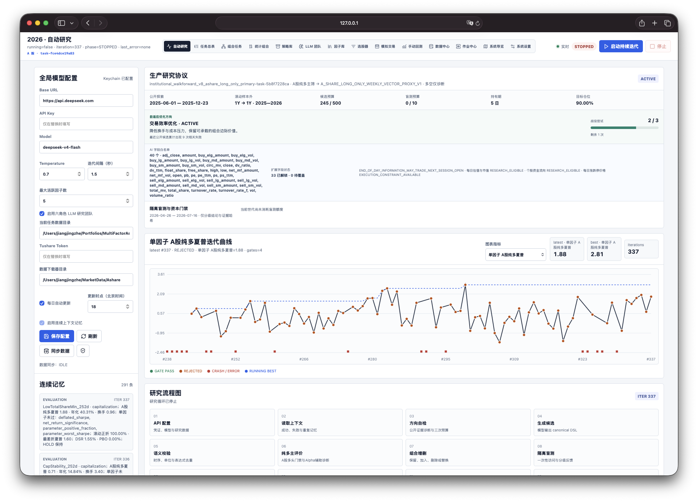
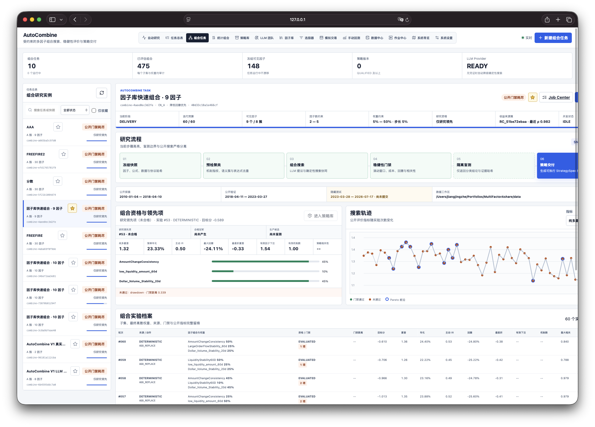
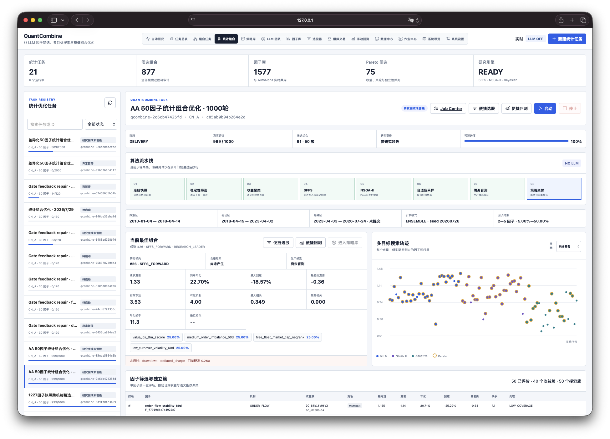
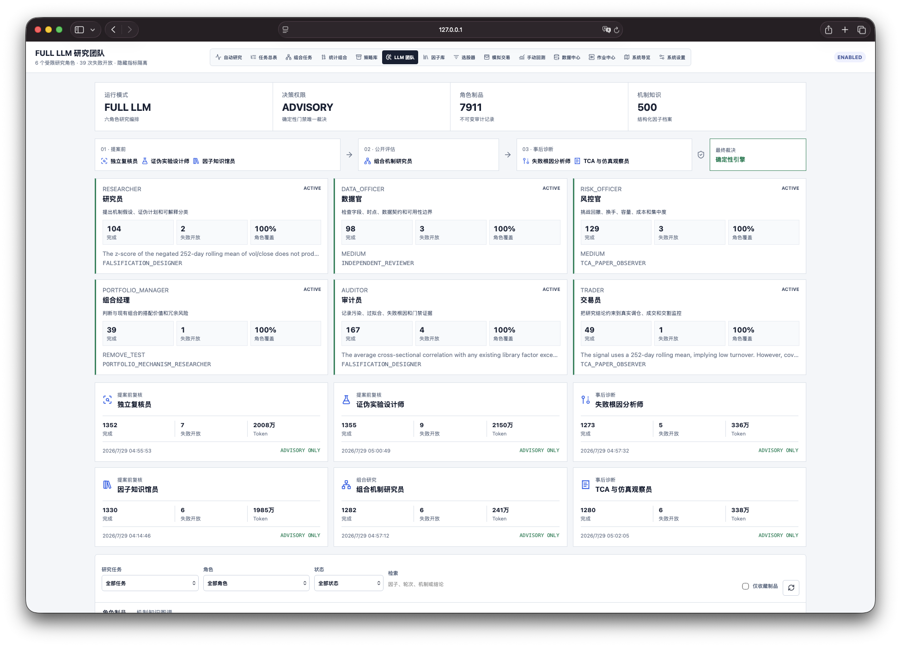
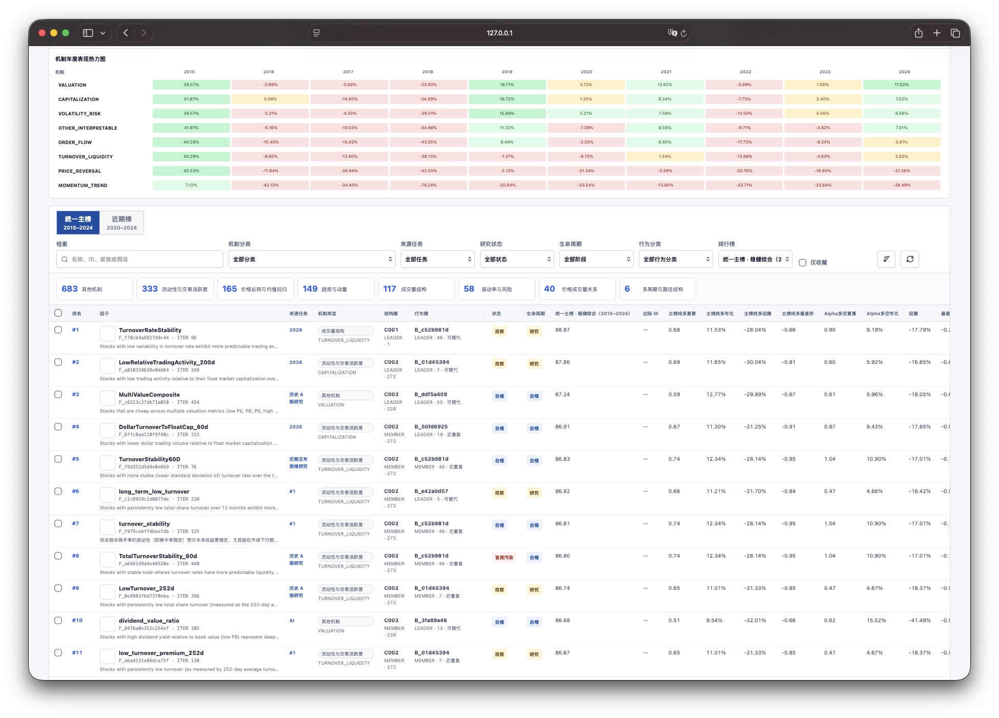
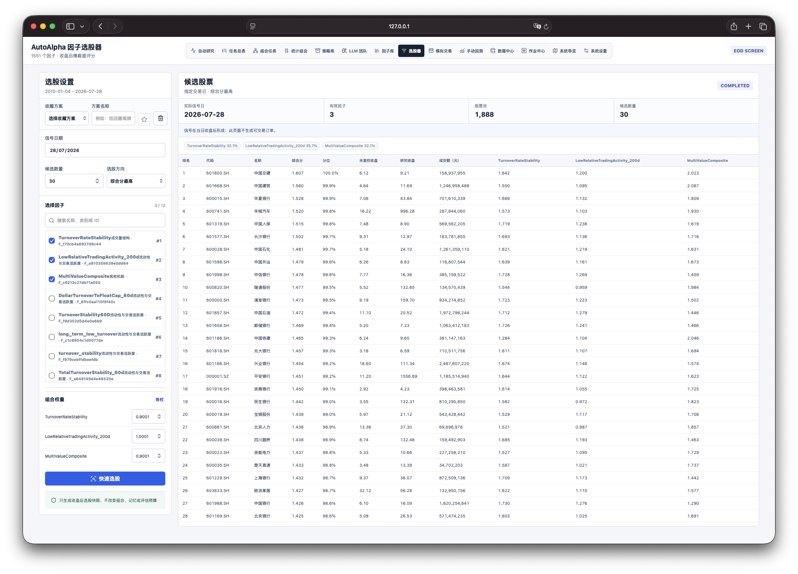
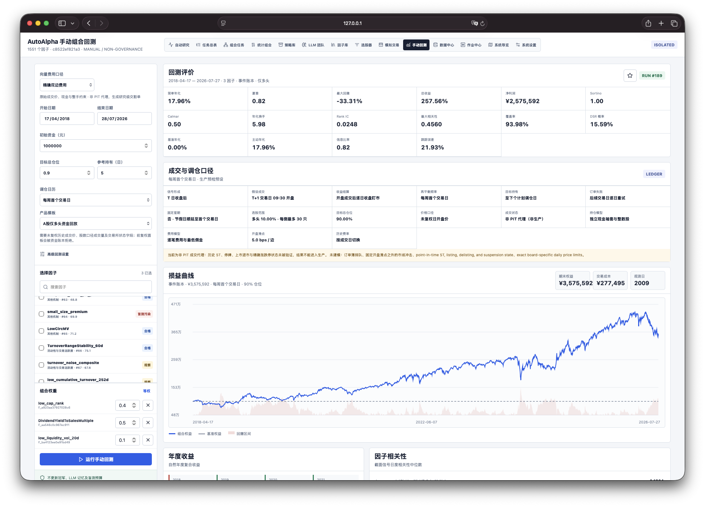
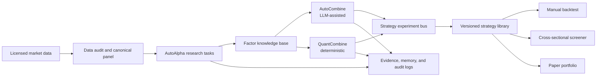

<div align="center">

# LLM_QUANT_FACTORY

### Auditable multi-agent factor research and portfolio discovery for A-shares

A source-available, noncommercial workbench for cross-sectional A-share multi-factor research,
covering data
governance, LLM-assisted factor discovery, factor knowledge management, constrained portfolio
search, screening, backtesting, audit trails, and strategy versioning.

[](https://github.com/khakhasshi/LLM_QUANT_FACTORY/actions/workflows/ci.yml)
[](LICENSE)
[](https://www.python.org/)
[](https://docs.astral.sh/uv/)
[](#research-boundary)
[](#research-boundary)

[Quick start](#quick-start) · [Architecture](#architecture) ·
[Public sample](#public-research-snapshot) · [Contributing](CONTRIBUTING.md) ·
[WeChat community](#wechat-community) · [Roadmap](ROADMAP.md) · [简体中文](README.md)

</div>

---

LLM_QUANT_FACTORY does not ask a language model to directly decide what to buy. Instead, it places LLMs
inside an auditable, falsifiable research system governed by deterministic protocols. LLMs propose
mechanism hypotheses, generate constrained expressions, and produce structured research opinions.
Data-timing checks, backtests, statistical tests, portfolio weights, risk gates, and strategy
delivery remain deterministic.

> [!IMPORTANT]
> The local A-share panel used in the screenshots is a **non-PIT research proxy**. Historical
> performance, rankings, and screening results demonstrate the workflow only. They are not
> production qualifications, forecasts, or investment advice. Real deployment still requires PIT
> security states, adjusted research prices and unadjusted execution prices, price-limit and
> suspension rules, delisting handling, costs, capacity analysis, and independent blind tests.

## Product tour

### 1. AutoAlpha: continuous factor research

Each research task freezes its market, data visibility, exploration period, rolling validation
period, and hidden test. The system continuously executes mechanism diagnosis, candidate generation,
timing validation, long-only evaluation, portfolio actions, and auditable persistence. The page
shows live metric curves, workflow state, continuous memory, and four classes of logs.



### 2. AutoCombine: LLM-assisted portfolio research

AutoCombine freezes a candidate snapshot from the factor knowledge base and searches within explicit
limits on factor count, weight increments, objectives, and time protocols. LLMs may suggest
combination hypotheses and interpret marginal contribution, but they cannot bypass deterministic
gates, approve a strategy, or read hidden-test metrics.



### 3. QuantCombine: deterministic portfolio optimization

QuantCombine uses no LLM. It combines SFFS, NSGA-II, adaptive sampling, and Pareto ranking for factor
selection, subset search, and non-negative weight optimization. Every candidate retains its factors,
weights, after-cost long-only performance, worst-fold diagnostics, correlations, effective bets, and
failed gates.



### 4. Structured LLM research team

Researcher, data officer, risk officer, portfolio manager, auditor, and trader roles each produce
structured artifacts. Independent review, falsification design, failure attribution, and execution
analysis enter one evidence chain. Final decisions still belong to deterministic engines and human
risk approval.



### 5. Factor knowledge base

The factor library is more than a leaderboard. It stores formulas and ASTs, mechanism types, source
tasks, behavior and homogeneity clusters, lifecycle state, standardized long-only metrics, annual
performance, failure labels, and marginal portfolio contribution. This helps distinguish a genuinely
new mechanism from a parameter variant.



### 6. Cross-sectional screener

Select one or more factors, assign weights, and choose a signal date to generate a cross-sectional
stock list. The result explicitly states that the signal is formed after the close. This page does
not place orders and does not contaminate automatic research memory or hidden tests.



### 7. Manual long-only backtest

Manual backtests support factors and weights, date ranges, initial capital, target exposure, holding
period, rebalance calendar, cost presets, event-ledger or vector engines, favorites, and trade
ledgers. A-share long-only capital performance is primary; long-short IC remains diagnostic.



## Architecture



The repository is a monorepo with two main layers:

| Layer | Path | Responsibility |
|---|---|---|
| Data engineering | `src/multifactor_ashare/` | Audit immutable daily snapshots and build a canonical year-partitioned DuckDB/Parquet panel |
| Research platform | `AutoAlpha/` | Factor discovery, knowledge management, portfolio optimization, backtesting, governance, and web services |

The research platform exposes one shared experiment lineage:

```text
factor candidate
  -> mechanism / behavior cluster
  -> combination candidate
  -> strategy version
  -> paper portfolio
  -> production candidate (human approval required)
```

Every stage carries a stable ID, protocol fingerprint, data snapshot, metrics, failed gates, and
evidence links.

## What is implemented

| Area | Current capability |
|---|---|
| Research orchestration | Multiple isolated AutoAlpha tasks with independent data visibility, protocols, memory, and lifecycle |
| Factor language | Typed expression trees, field whitelists, signal timing, and look-ahead checks |
| Evaluation | A-share long-only primary metrics, walk-forward folds, DSR/PBO/FDR, parameter neighborhoods, cost, and capacity diagnostics |
| Knowledge management | Mechanism taxonomy, AST signatures, semantic/behavior clusters, lifecycle, annual heatmaps, and favorites |
| Combination research | LLM-assisted AutoCombine and deterministic QuantCombine over the same frozen factor registry |
| Backtesting | A fast vector engine plus an event/cash-ledger path, configurable execution assumptions, trades, and artifacts |
| Operations | Job queues, checkpoints, retries, immutable artifacts, four log classes, and health endpoints |
| Data center | Workspace inspection, Tushare credential boundaries, resumable incremental updates, and quality reports |

Detailed controls:

- [Institutional research controls](AutoAlpha/docs/INSTITUTIONAL_RESEARCH_CONTROLS.md)
- [Evaluation constitution](AutoAlpha/evaluation.md)
- [Data readiness](AutoAlpha/docs/DATA_READINESS.md)
- [AutoCombine design](AutoAlpha/docs/AUTOCOMBINE.md)
- [QuantCombine design](AutoAlpha/docs/QUANTCOMBINE.md)
- [Vector backtest reconciliation](AutoAlpha/docs/VECTOR_BACKTEST_ENGINE.md)
- [Production runbook](AutoAlpha/docs/PRODUCTION_RUNBOOK.md)

## Research boundary

The system deliberately separates research convenience from production evidence:

- A-share **long-only capital performance** is the primary ranking and display convention.
- Rank IC and long-short alpha are diagnostics; they cannot compensate for a failed execution or
  risk gate.
- End-of-day signals are available only after the close and execute no earlier than the next
  session open.
- Public walk-forward results may guide research; hidden-test details never enter the LLM context.
- A failed hard gate cannot be averaged away by a composite score.
- Manual backtests, screenshots, and public examples never enter automatic research memory.
- Raw market data, API credentials, local runtime databases, and private LLM conversations are not
  distributed.

## Quick start

### Prerequisites

- macOS or Linux
- Python 3.12+
- [`uv`](https://docs.astral.sh/uv/)
- Your own licensed A-share data
- Optional: an OpenAI-compatible API endpoint for LLM-assisted research

### 1. Clone and install

```bash
git clone https://github.com/khakhasshi/LLM_QUANT_FACTORY.git
cd LLM_QUANT_FACTORY

uv sync --frozen --all-groups
cd AutoAlpha
uv sync --frozen --all-groups
```

### 2. Prepare data

Place your licensed source data under `data/`, then run the reproducible audit and panel build:

```bash
cd ..
uv run mf-data audit
uv run mf-data build
```

The canonical output is written to `data/processed/daily_panel/`. Raw and generated market data are
ignored by Git.

### 3. Configure optional credentials

Use environment variables or the system keychain. Never commit credentials:

```bash
cd AutoAlpha
export AUTOALPHA_DATA_PATH="$PWD/../data"
export OPENAI_BASE_URL="https://api.openai.com/v1"
export AUTOALPHA_MODEL="your-model"
export AUTOALPHA_API_KEY="your-api-key"
export AUTOALPHA_SERVICE_TOKEN="replace-with-a-strong-local-token"
```

See [`AutoAlpha/.env.example`](AutoAlpha/.env.example) for commonly used settings.

### 4. Start the services

```bash
./start-services.sh --no-resume
```

| Service | URL | Purpose |
|---|---|---|
| AutoAlpha | http://127.0.0.1:8788 | Research tasks, factor library, screener, backtest, paper portfolios, data, and jobs |
| AutoCombine | http://127.0.0.1:8888 | LLM-assisted constrained factor combination research |
| QuantCombine | http://127.0.0.1:8889 | Deterministic statistical combination optimization |

Stop all three services with:

```bash
./stop-services.sh
```

The scripts are idempotent. No historical task is resumed unless
`AUTOALPHA_RESUME_TASK_ID` or `AUTOCOMBINE_RESUME_TASK_ID` is explicitly set.

## Public research snapshot

[`examples/public_research_snapshot/`](examples/public_research_snapshot/) contains a small,
sanitized export from a real local research database:

| Public record | Count | What it demonstrates |
|---|---:|---|
| Factor definitions | 12 | Typed expressions and lineage across reversal, liquidity, volatility, valuation, order-flow, capitalization, and momentum mechanisms |
| Combination candidates | 3 | Frozen factors and weights, long-only diagnostics, failed gates, and `RESEARCH_LEADER` semantics |
| Strategy specifications | 1 | Versioned signal, rebalance, execution, risk, cost, and monitoring policies |
| Audit events | 20 | Sanitized action/research/audit/delivery records with a recomputed public hash chain |

The sample intentionally excludes prices, security-level returns, holdings, private prompts,
hidden-test results, credentials, local paths, and executable production decisions. It demonstrates
data contracts; it is not a benchmark and cannot reproduce the screenshots without separately
licensed market data.

To regenerate a sanitized snapshot from your own local runtime:

```bash
uv run python scripts/export_public_research_snapshot.py \
  --database AutoAlpha/runtime-full-llm/autoalpha.sqlite3 \
  --output examples/public_research_snapshot
```

## Repository layout

```text
.
├── src/multifactor_ashare/       # data audit and canonical panel CLI
├── tests/                        # data-pipeline tests
├── AutoAlpha/
│   ├── src/autoalpha/            # research and service implementation
│   ├── config/                   # versioned research protocols
│   ├── docs/                     # institutional controls and runbooks
│   ├── tests/                    # unit, integration, and adversarial tests
│   ├── start-services.sh
│   └── stop-services.sh
├── examples/public_research_snapshot/
├── docs/assets/screenshots/
├── scripts/                      # public export and release checks
└── .github/                      # CI and contribution templates
```

## Development

Run the complete local validation:

```bash
# Data layer
uv run ruff check src tests scripts
uv run ruff format --check scripts/check_public_release.py scripts/export_public_research_snapshot.py
uv run pytest -q

# Research platform
cd AutoAlpha
uv run ruff check .
uv run pytest -q

# Source-available release hygiene
cd ..
uv run python scripts/check_public_release.py
uv build --out-dir /tmp/multifactor-ashare-dist

# AutoAlpha package
cd AutoAlpha
uv build --out-dir /tmp/autoalpha-dist
```

See [CONTRIBUTING.md](CONTRIBUTING.md) for workflow, test expectations, and research-evidence
rules. Agents and second-stage developers should begin with [AGENTS.md](AGENTS.md), which maps
the services, code ownership, data and research invariants, change recipes, tests, and handoff
format.

## Roadmap and help wanted

The project especially welcomes collaboration on problems that remain genuinely difficult:

1. **Finer-grained factor knowledge management**
   Better mechanism ontologies, parameter-family folding, temporal decay profiles, failure labels,
   marginal-contribution maps, and searchable evidence lineage.

2. **Collaboration among multiple LLM threads and models**
   Structured handoffs, disagreement protocols, role-specific memory, model diversity, cost
   controls, and reproducible multi-agent deliberation without bypassing deterministic governance.

3. **Factor homogeneity and false novelty**
   AST-level equivalence, semantic fingerprints, signal/return behavior clustering, residual
   discovery, and incentives that reward independent portfolio contribution instead of cosmetic
   formula changes.

4. **Point-in-time data and realistic A-share execution**
   Historical ST/listing/delisting/suspension states, board-specific price limits, corporate-action
   revisions, open-time tradability, lot/cash constraints, impact, and capacity.

5. **Strategy lifecycle beyond factor scores**
   Explicit entry/exit rules, versioned strategy specifications, shadow trading, decay monitoring,
   retirement, and reproducible promotion evidence.

The longer list is maintained in [ROADMAP.md](ROADMAP.md). Please open a discussion or issue before
large architectural changes so evidence contracts remain compatible.

## Source-available status

Release preparation checks and remaining repository-host settings are tracked in
[docs/SOURCE_AVAILABLE_CHECKLIST.md](docs/SOURCE_AVAILABLE_CHECKLIST.md). By design, the repository contains no
raw market dataset, runtime SQLite database, log archive, or API key.

## WeChat community

Join **LLM_Quant_Factory** to discuss automated factor research, portfolio optimization, data
engineering, and multi-agent collaboration.

<p align="center">
  
</p>

WeChat invitation QR codes expire. If this one is no longer valid, contact the author below for
the current code.

## Author and contact

**江景哲 / JIANGJINGZHE**

- Email: [contact@jiangjingzhe.com](mailto:contact@jiangjingzhe.com)
- Phone: [+852 6851 5553](tel:+85268515553)
- GitHub: [@khakhasshi](https://github.com/khakhasshi)

For security reports, follow [SECURITY.md](SECURITY.md) instead of opening a public issue.

## Citation

If this project supports published research, cite the repository and pin the exact commit, research
protocol fingerprint, and data snapshot. A machine-readable entry is provided in
[`CITATION.cff`](CITATION.cff).

## License

Copyright 2026 Jiang Jingzhe.

Beginning 2026-07-29, the current version is distributed under the
[PolyForm Noncommercial License 1.0.0](LICENSE). Personal research, experimentation, study, and
the noncommercial-organization uses listed in the license are permitted. **Commercial use is not
licensed and requires separate prior written permission from the copyright holder.** Contact
[contact@jiangjingzhe.com](mailto:contact@jiangjingzhe.com) for commercial licensing.

This is a source-available license, not an OSI-approved open-source license. The change does not
retroactively revoke rights in any historical version that a recipient previously obtained under
Apache-2.0, if applicable. Market data, third-party model services, and external datasets retain
their own licenses and are not relicensed by this repository.

This software is provided for research and engineering purposes only. Nothing in this repository
constitutes investment advice, an offer, a solicitation, or a guarantee of performance.
